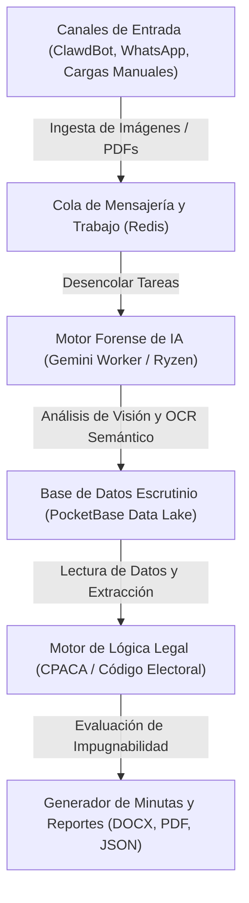

<div align="center">

</div>

# 🗳️ AUDITOR.IA (E14-AUDITOR)

> **Desarrollado y optimizado por [BABYLON.IA](https://babylonias.com/) (Juan Esteban Gómez Bernal)**

**AUDITOR.IA** es un centro de control y panel de auditoría electoral forense en tiempo real diseñado para procesar, visualizar y analizar actas de escrutinio de jurados (formularios E-14 de la Registraduría Nacional del Estado Civil de Colombia). El sistema integra un pipeline robusto para la ingesta masiva de actas, análisis forense mediante visión artificial con modelos generativos avanzados de IA (Google Gemini API), detección de anomalías aritméticas y alteración de documentos, y generación automatizada de recursos legales de impugnación.

El repositorio se encuentra optimizado e interoperable para las **elecciones presidenciales de segunda vuelta en Colombia (21 de junio de 2026)**, cubriendo el análisis y reconciliación de la votación entre los candidatos **Iván Cepeda Castro (Pacto Histórico)** y **Abelardo de la Espriella (Defensores de la Patria)**.

---

## 🏗️ Arquitectura del Sistema y Flujo de Datos

El flujo de procesamiento del sistema está diseñado bajo una arquitectura orientada a microservicios altamente resiliente y escalable:



### Componentes Clave:
1. **Canales de Entrada (Ingesta):** Ingesta automática de imágenes y documentos multipágina de formularios E-14 provenientes de bots de WhatsApp (`ClawdBot`) y escrutadores en las mesas.
2. **Cola de Mensajería (Redis):** Amortigua la carga de procesamiento masivo en tiempo real durante la jornada electoral.
3. **Motor Forense de IA (Gemini/Ryzen Workers):** Consume la API de Google Gemini para segmentar la imagen, extraer los datos manuscritos estructurados (votos por mesa/zona/municipio) y evaluar alteraciones físicas o adulteraciones en la imagen.
4. **Data Lake (PocketBase):** Consolidación histórica del preconteo auditado y los hallazgos periciales.
5. **Motor de Lógica Legal:** Evalúa la intención estratégica del fraude e infiere la impugnabilidad de la mesa de votación conforme a la ley colombiana.

---

## 🕵️ Módulo de Auditoría Forense y Modelado de IA

El núcleo forense utiliza los modelos de lenguaje multimodal de Google (`gemini-2.5-flash-latest`) para analizar las actas de escrutinio digitalizadas mediante técnicas avanzadas de comprensión visual:

### Capacidades de Análisis del Sistema:

| Anomalía Detectada | Descripción Técnica | Acción del Sistema |
| :--- | :--- | :--- |
| **Tachones (Erasures)** | Remarcados o tachados en las celdas de números de votos que intentan cambiar el valor original. | Genera un hallazgo pericial indicando la diferencia entre el valor original inferido y el final legible. |
| **Enmendaduras (Amendments)** | Modificaciones en los dígitos manuscritos (por ejemplo, convertir un "0" en un "8" o añadir un dígito extra). | Calcula el impacto de votos de diferencia en contra de nuestro candidato o a favor del rival. |
| **Fraude Aritmético (Math Discrepancy)** | Inconsistencias entre la suma de los votos individuales por candidatura y el total declarado en el acta. | Marca el documento automáticamente como **IMPUGNABLE** por causal aritmética objetiva. |
| **Discrepancia Multiversión** | Comparación de las tres copias del formulario E-14 (Claveros, Delegados, Transmisión). | Alerta de discrepancias si los ejemplares no coinciden en sus registros de votación. |

---

## ⚖️ Motor de Análisis de Impacto Estratégico y Lógica Legal

El sistema no solo extrae números; aplica lógica de negocio electoral personalizada (`runBusinessLogic`) para calcular el impacto real y determinar las acciones jurídicas prioritarias:

### Modos de Operación Legal:
* **Modo Autodetectar (IA):** Identifica a quién le conviene la impugnación de forma neutral basándose en el análisis aritmético de pérdidas y ganancias de votos.
* **Modo Dirigido (Campaña):** Prioriza la defensa de los intereses de la candidatura del cliente:
  * **PERJUICIO (Impugnar):** Se activa cuando se detecta que al cliente (**Iván Cepeda Castro**) se le restaron votos válidos, o al rival principal (**Abelardo de la Espriella**) se le añadieron votos de forma fraudulenta. Genera automáticamente una acción judicial de nulidad.
  * **BENEFICIO (Reconteo):** Se activa cuando la anomalía beneficia de forma errónea al cliente o perjudica al rival, recomendando un reconteo transparente en lugar de una impugnación directa de la mesa.
  * **VALIDAR / NEUTRO:** El acta coincide en todas sus sumas y no tiene marcas de sospecha. Se aprueba para consolidación directa.

### Generación de Minuta Judicial Automatizada:
El sistema genera reportes legales instantáneos basados en la normativa vigente colombiana:
* **Artículo 275 de la Ley 1437 de 2011 (CPACA):** Específicamente causales 3 (alteración de datos electorales) y 4 (errores aritméticos).
* **Decreto 2241 de 1986 (Código Electoral Colombiano):** Artículos 164 y 192 que sustentan las impugnaciones de mesas ante claveros y delegados.
* **Formatos Disponibles:** Exportación en Texto Plano (`.txt`) para minutas de demanda, y consolidaciones grupales en Word (`.docx`) y Hojas de Cálculo (`.xlsx`).

---

## 🛠️ Stack Tecnológico

El proyecto está diseñado como una aplicación de página única (SPA) modular y de alto rendimiento:

* **Frontend:** React 19, TypeScript, Vite.
* **Diseño y Estilo:** Tailwind CSS (tema oscuro premium, glassmorphism, colores adaptativos y microanimaciones de estado de carga).
* **Íconos:** `lucide-react`.
* **Visualización de Datos:** `recharts` para el procesamiento dinámico y renderizado de gráficos electorales y estado de colas en tiempo real.
* **Lógica del Servidor:** Servidor API en Bun (para escaneo y reenvío de archivos a la API de Gemini) usando el SDK oficial `@google/genai`.
* **Pruebas y QA:** `bun test` en combinación con `@testing-library/react` y `happy-dom` para la simulación del entorno del navegador y mocks automatizados de la API.

---

## 🚀 Instalación y Puesta en Marcha

### Prerrequisitos
* Tener instalado **Node.js** (versión 18 o superior) o **Bun** (recomendado para ejecución local y pruebas).
* Contar con una API Key de Google Gemini (puedes obtenerla de forma gratuita en [Google AI Studio](https://aistudio.google.com/)).

### Pasos para Ejecutar Localmente

1. **Clonar e instalar dependencias:**
   ```bash
   cd C:/Users/jegom/Documents/E14-AUDITOR
   bun install
   # o usando npm
   npm install
   ```

2. **Configurar las variables de entorno:**
   Copia el archivo de ejemplo `.env.example` y renómbralo a `.env`:
   ```bash
   cp .env.example .env
   ```
   Abre el archivo `.env` y configura tu API Key:
   ```env
   VITE_GEMINI_API_KEY=tu_gemini_api_key_aqui
   API_KEY=tu_gemini_api_key_aqui
   ```

3. **Ejecutar el servidor del Backend de Análisis (Bun):**
   Este servidor recibe las imágenes en base64 del cliente, procesa la llamada a la API de Gemini de forma segura e inyecta la lógica de negocio legal:
   ```bash
   bun run server.ts
   # o usando el script de npm
   npm run server
   ```
   *El servidor de backend correrá por defecto en el puerto `3001`.*

4. **Ejecutar el Frontend de Desarrollo (Vite):**
   ```bash
   bun run dev
   # o
   npm run dev
   ```
   *Abre tu navegador en `http://localhost:5173` para interactuar con la consola de auditoría.*

---

## 🐳 Despliegue en Contenedores (Docker)

El repositorio incluye soporte para despliegues rápidos y reproducibles con contenedores utilizando Docker Compose:

1. Asegúrate de tener configurada tu API Key en el archivo `.env`.
2. Compila y levanta la infraestructura:
   ```bash
   docker-compose up -d --build
   ```
3. La aplicación estará accesible en el puerto `3000` (`http://localhost:3000`), sirviendo tanto la API del Backend como el Frontend compilado a través del archivo de configuración de Nginx integrado.

---

## 🧪 Pruebas Unitarias e Integración

El proyecto sigue metodologías de desarrollo guiado por pruebas (TDD) para garantizar que los cálculos legales y de integridad no sufran regresiones:

Para ejecutar todas las pruebas sintácticas e instrumentales:
```bash
bun test --preload ./test-setup.ts
```

Las pruebas cubren:
* **`App.test.tsx`**: Renderizado de componentes de barra lateral, enrutamiento interno de pestañas y manipulación de cabeceras.
* **`geminiService.test.ts`**: Lógica de impacto electoral (`runBusinessLogic`) cubriendo los escenarios de **PERJUICIO** y **BENEFICIO** en modo dirigido y autodetectar.
* **`registraduriaService.test.ts`**: Fallbacks, mapeo de municipios/zonas/mesas de votación e integración del scraper electoral.
* **`CSVInjection.test.ts`**: Validación de seguridad para evitar vulnerabilidades de inyección de fórmulas al exportar datos del Data Lake.
* **`Dashboard.test.tsx`**: Renderizado correcto de tarjetas de métricas del preconteo.

---

## 🔒 Seguridad y Privacidad
* **Protección del Data Lake:** Las exportaciones de datos filtran y escapan caracteres sensibles (caracteres `+`, `-`, `=`, `@` en formato CSV) para mitigar vectores de ataque por inyección de macros.
* **Entornos Seguros:** La API Key de Gemini se consume exclusivamente a nivel de servidor (`server.ts`) o variables cifradas de cliente. Nunca expongas tu archivo `.env` en sistemas de control de versiones públicos.

---
*Desarrollado con dedicación en Medellín, Colombia, bajo la visión arquitectónica de **BABYLON.IA** y el liderazgo de **Juan Esteban Gómez Bernal**.*
